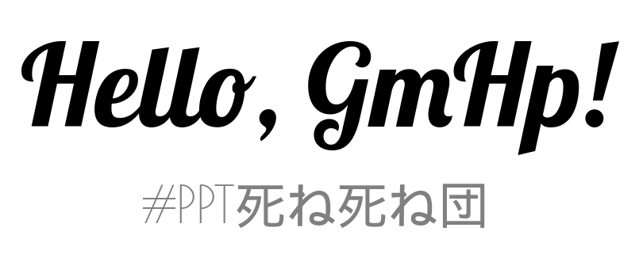

gmhp
====

**GmHp**, or **GemHeap**, an amateur slideshow generator with features
like Markdown imports, HTML and PDF exports, etc. This generator was
influenced by S<sup>5</sup> tools (e.g. `rst2s5` in Python package
`docutils`) and `reveal.js`.

- **GmHp** is also the abbreviation of
    + **G**enerate **M**y **H**omemade **P**resentation
    + **G**enerate **M**arkdown **H**TML **P**DF

Example
-------

Write a text file in Markdown and use horizontal rules to separate
the content, which will be divided into different slides. For instance,

```markdown
# Hello, GmHp! #

## #PPT死ね死ね団 ##

---

### Not Bad ###

- List
    + Item 0
    + Item 1
    + Item 2
```

will be translated to the HTML (but not pretty printed in fact):

```html
<section id="slide0">
  <h1>Hello, GmHp!</h1>
  <h2>#PPT死ね死ね団</h2>
</section>
<section id="slide1">
  <h3>Not Bad</h3>
  <ul>
    <li>List
      <ul>
        <li>Item 0</li>
        <li>Item 1</li>
        <li>Item 2</li>
      </ul>
    </li>
  </ul>
</section>
```



Full demostration page in [English](http://anqurvanillapy.github.io/gmhp/)
([source code](https://raw.githubusercontent.com/anqurvanillapy/gmhp/gh-pages/demo.md))
/ [中文](http://anqurvanillapy.github.io/gmhp/index-zh_cn.html)
([源代码](https://raw.githubusercontent.com/anqurvanillapy/gmhp/gh-pages/demo-zh_cn.md))

Requirements
------------

In `Python 2.7`. According to `requirements.txt` generated by
`pipreqs` these packages are needed:

```
Jinja2 == 2.8
Markdown == 2.6.5
Pygments == 1.6
setuptools == 3.3
```

Installation
------------

Clone this repo and run the setup file

```bash
$ git clone git@github.com:anqurvanillapy/gmhp.git
$ cd gmhp
$ python setup.py install
# command 'sudo' may be needed 
```

Notice that the data files will be stored at `~/.gmhp`, including
HTML templates, themes CSS and some Google fonts.

Usage
-----

Select your input Markdown file and name the output HTML page, in the
meanwhile you can choose a theme by using `--theme` or `-t` argument,
or ignore this argument to use *white* theme by default. 

```bash
$ gmhp slides.md index.html --theme white
```

### Currently Stylised Tags ###

The HTML tags stylised in this generator are as follows, therefore
the styles of the other ones will be executed by the user agent
stylesheet.

- Paragraph, `<p></p>`
- List, `<ul></ul>` and `<ol></ol>`
- Title and subtitle, `<h1></h1>` and `<h2></h2>`
- Page header, `<h3></h3>`
- Hyperlink, `<a></a>`
- Block quotation, `<blockquote></blockquote>`
- Code block, `<pre></pre>`
- Image, ``
- Code, `<code></code>`

If the content is in **CJK**, you can simply use `**bold**` to stress
the titles, page headers, etc., for CJK web fonts are not available in
this project.

### Key Bindings ###

- Skip to the next slide:
    + <kbd>Right</kbd>
    + <kbd>Down</kbd>
    + <kbd>Enter</kbd>
    + <kbd>Space</kbd>
- Skip to the last slide:
    + <kbd>Up</kbd>
    + <kbd>Left</kbd>
    + <kbd>Backspace</kbd>

### Themes ###

- Currently available themes are:
    + **White** (as default)

### Export PDF ###

Open the generated slideshow on **Google Chrome**, and select
`Print...` or press <kbd>Ctrl + P</kbd> to preview the printed pages.
Then configure the settings as follows:

- **Destination**: `Save as PDF`
- **Layout**: `Landscape`
- **Paper size**: `A4`
- **Margins**: `None`
- **Options**: `Background graphics` checked

### Customization ###

You can add your own stylesheets in the data directory `.gmhp` and
please remember the theme name is the file name of CSS. Furthermore,
the fonts used in the generated pages are treated as default typefaces
and will be straightly rendered **ahead of** the theme CSS! *This is an
issue I will cope with in the future.*

- The ahead-of-theme-CSS-rendering fonts are:
    + Lobster (`Lobster-Regular.ttf`)
    + Poiret One (`PoiretOne-Regular.ttf`)
    + Merriweather (`Merriweather-Regular.ttf`)

TODOs
-----

* [x] Create branch `gh-pages` for demostration.
* [ ] ~~Use some web fonts to support CJK characters.~~ (Most of the
web font services of CJK font family are restricted, or in huge size,
making the offline presentation difficult.)
* [x] Support table syntax and related styles.
* [ ] Update stylesheets of more themes. (Black, fluid, Takahashi
method, etc.)
* [ ] Add a feature of toggling the slideshow outline.
* [ ] ~~Cope with font family customization.~~
* [ ] Create specifications of themes for customization.
* [ ] Make a share source directory to simplify the presentation web
pages.
* [ ] Add an option to specify whether CDN links or Base64 data should
be used for fonts.
* [ ] Different presentation templates of single slices based on order of
elements and contents.
* [ ] **Put these TODOs on Issues**.

License
-------

MIT. See `LICENSE` file. And [Google Fonts](https://www.google.com/fonts)
are used in this project.
