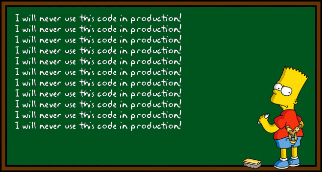

# Hello, world!

## Powered by [GmHp](https://github.com/anqurvanillapy/gmhp)

---

### Example

Simply use horizontal rules (`<hr>`) to separate slides

```markdown
# Hello, world!

---

### Nailed It!

`<h3></h3>` is the page header!
```

---

### Plain Text & Quotes

Grumpy wizards make toxic brew for the evil Queen and Jack.

> "You go tell that vapid existentialist quack Freddy Nietzsche that
he can just bite me, twice."

---

### Unordered List

- Pangrams
    + New job: fix Mr. Gluck's hazy TV, PDQ!
    + Jackdaws love my big sphinx of quartz.
    + Pack my box with five dozen liquor jugs.

---

### Ordered List

- Pangrams
    1. New job: fix Mr. Gluck's hazy TV, PDQ!
    2. Jackdaws love my big sphinx of quartz.
    3. Pack my box with five dozen liquor jugs.

---

### Image



---

### Table

| Name | Age | Nationality |
|------|-----|-------------|
| John | 18  |  American   |
| Mike | 17  |   English   |
| Luke | 20  |   Chinese   |

---

### Code Block

```python
def fibonacci():
    a, b = 0, 1
    while True:
        yield a
        a, b = b, a + b

for i in fibonacci():
    if i < 50:
        print(i)
    else:
        break
```

---

### PDF Export

On Goolge Chrome click on `Print...` to save this as PDF. Remember
select `Landscape` in layout and `None` in margins. :)

---

### Influenced By

- Amazing slideshow tools!
    + [`rst2s5`](http://docutils.sourceforge.net/docs/user/slide-shows.html)
    + [`reveal.js`](https://github.com/hakimel/reveal.js)

---

### About

- Developed by [AnqurVanillapy](https://anqurvanillapy.github.io)
- This demo page in [English](index.html) / [中文](index-zh_cn.html)

## Enjoy your presentation!
